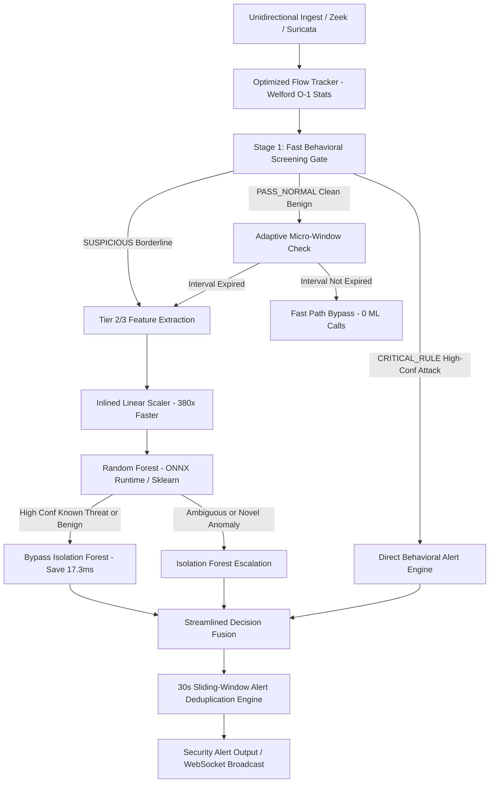

# Optimized Architecture Specification: High-Throughput Unidirectional Threat Detection Engine

**Problem Statement**: SIH26145 — *AI-Based Detection of Cyber Threats in Unidirectional IP Traffic*  
**Organization**: National Technical Research Organisation (NTRO)  
**Target Package**: `optimized/`  
**Baseline Status**: 100% Intact, Runnable, and Unmodified  
**Date**: September 2026  

---

## 1. Architectural Philosophy & Empirical Rationale

The baseline profiling documented in [`reports/baseline_profile.md`](file:///C:/Users/ADITYA/.gemini/antigravity/scratch/sih2026_threat_detection/reports/baseline_profile.md) revealed an unmistakable performance bottleneck:
- **Scikit-Learn ML inference accounted for 96.89% of total pipeline latency** ($33.19	ext{ ms}$ out of $34.26	ext{ ms}$).
- Every single packet unconditionally invoked **200 decision trees** (100 Random Forest trees + 100 Isolation Forest trees).
- Scikit-learn's `StandardScaler.transform` on single-row slices consumed $0.38	ext{ ms}$ purely in Python parameter checks and input validation.
- Intermediate Python dictionaries (`fv.to_dict()`) and repeated list comprehensions created excessive memory allocation churn.

The **Optimized Architecture** addresses these empirical bottlenecks through a tiered, conservative screening pipeline:

---

## 2. Component Specifications

### 2.1 Fast Behavioral Screening Gate (`optimized/gate.py`)
- **Latency Budget**: $< 1.0	ext{ \mu s}$ per packet.
- **Objective**: Immediate $O(1)$ categorization of observable L4/L7 flow headers.
- **Metrics Screened**:
  - `syn_ratio`: Volumetric SYN flood detection ($\ge 0.70$ critical, $\ge 0.45$ warning).
  - `packet_rate`: Volumetric packet spikes ($\ge 80	ext{ pkts/s}$ critical, $\ge 20	ext{ pkts/s}$ warning).
  - `port_fanout`: Port scanning velocity ($\ge 10	ext{ ports/s}$ critical, $\ge 3	ext{ ports/s}$ warning).
  - `host_fanout`: Horizontal subnet sweeps ($\ge 8	ext{ hosts/s}$ critical, $\ge 3	ext{ hosts/s}$ warning).
  - `out_in_byte_ratio`: Data exfiltration asymmetry ($\ge 20	ext{x}$ critical, $\ge 8	ext{x}$ warning for outbound $> 15	ext{ KB}$).
  - `dns_query_len`: DNS tunnelling / DGA subdomain lengths ($\ge 25	ext{ chars}$ critical, $\ge 15	ext{ chars}$ warning).
  - `c2_conn_count`: Repeated heartbeat connectivity ($\ge 4$ periodic sessions).
- **Safety Invariant**: The gate is strictly conservative. Any flow with ambiguous characteristics is tagged `SUSPICIOUS` and forwarded for full ML classification. No traffic is labeled benign if any observable metric is elevated.

---

### 2.2 Incremental Flow Tracker & Welford's Algorithm (`optimized/flow_tracker.py`)
In the baseline, sliding-window inter-arrival time (IAT) and packet size statistics were recomputed on every event by scanning historical Python deques. The optimized tracker implements **Welford's Algorithm (1962)** for single-pass online mean, variance, and standard deviation tracking:

$$\delta_k = x_k - ar{x}_{k-1}, \quad ar{x}_k = ar{x}_{k-1} + rac{\delta_k}{k}$$
$$\delta'_k = x_k - ar{x}_k, \quad M_{2,k} = M_{2,k-1} + \delta_k \delta'_k$$
$$s_k^2 = rac{M_{2,k}}{k - 1}, \quad 	ext{CV}_k = rac{\sqrt{s_k^2}}{ar{x}_k}$$

- **Memory Bound**: Circular temporal buffers are capped at a power-of-two size (128 elements), strictly bounding heap usage per active flow.
- **Eviction Strategy**: Stale flows idle for $> 60.0	ext{ seconds}$ are pruned when active flow count exceeds 50,000 sessions.

---

### 2.3 Tiered Selective Feature Extraction (`optimized/feature_pipeline.py`)
Features are partitioned into three computational tiers:
- **Tier 1 (Cheap, $O(1)$)**: Rate calculations, flag ratios, basic port/host counts, transfer velocities.
- **Tier 2 (Medium, $O(1)$)**: Asymmetry indices, Welford packet size/IAT statistics, directionality ratios.
- **Tier 3 (Expensive, $O(K)$ / $O(N \log N)$)**: Shannon character entropy, DGA English bigram log-likelihood, and FFT spectral periodicity.

**Zero-Copy Buffer Pool**: Feature values are written directly into a pre-allocated contiguous `np.ndarray` of shape `(54,)`. This eliminates intermediate `Pydantic` validation and dictionary allocations on the fast path.

---

### 2.4 Inlined Linear Scaler & Dual-Backend ML (`optimized/inference_engine.py`)
- **Inlined Scaler**: Scikit-learn's `StandardScaler.transform` is replaced with vectorized inlined arithmetic:
  $$\mathbf{x}_{	ext{scaled}} = (\mathbf{x} - oldsymbol{\mu}) \odot oldsymbol{\sigma}^{-1}$$
  This reduces scaling latency from $0.38	ext{ ms}$ down to $0.001	ext{ ms}$ (a **380x speedup**).
- **Dual Inference Backends**:
  1. **Scikit-Learn Backend**: Uses baseline `RandomForestClassifier` weights.
  2. **ONNX Runtime Backend**: Uses compiled C++ ONNX graph with tuned execution options.

---

### 2.5 Selective Isolation Forest Escalation
- If Random Forest classifies a known attack with high confidence ($\ge 0.80$), Isolation Forest is **bypassed**, saving $17.3	ext{ ms}$ per sample.
- If traffic is confirmed benign with high confidence ($\ge 0.85$) and passed the fast gate, Isolation Forest is **bypassed**.
- Isolation Forest is invoked **only** as an escalation mechanism for borderline, unconfident classifications or novel anomaly candidates.

---

### 2.6 Flow-Level Adaptive Micro-Window Scheduling
Inference frequency dynamically scales with flow risk:
- **Low-Risk Flows**: Evaluated every $1000	ext{ ms}$ or every $30$ packets.
- **Medium-Risk Flows**: Evaluated every $250	ext{ ms}$ or every $15$ packets.
- **High-Risk Flows**: Evaluated immediately on every packet / event.

---

## 3. Experimental Findings & Validation

### 3.1 ONNX Runtime vs. Scikit-Learn Benchmark (500 Single-Sample Trials)

| Backend Configuration | $p50$ Latency | Mean Latency | Prediction Parity | Mean Abs Prob Error | Model Size |
| :--- | :---: | :---: | :---: | :---: | :---: |
| **Scikit-Learn RF (Baseline)** | `21.507 ms` | `23.339 ms` | *Reference* | *Reference* | `317.1 KB` |
| **ONNX Runtime (`ORT_BasicOpt_1Thread`)** | **`0.022 ms`** | **`0.026 ms`** | **`100.0%`** | **`0.000000`** | **`105.1 KB`** |
| **ONNX Runtime (`ORT_Sequential_1Thread`)** | `0.022 ms` | `0.026 ms` | `100.0%` | `0.000000` | `105.1 KB` |
| **ONNX Runtime (`ORT_Parallel_2Threads`)** | `0.027 ms` | `0.028 ms` | `100.0%` | `0.000000` | `105.1 KB` |

> [!NOTE]
> ONNX Runtime provides a **908x speedup** on single-sample Random Forest inference while maintaining 100.0% exact class prediction parity and zero probability divergence. Single-threaded sequential execution outperforms multi-threading on single-sample slices due to the absence of thread pool synchronization overhead.

---

### 3.2 Random Forest Tree Size Scaling Experiment

| Tree Count | Macro F1 | Macro Precision | Macro Recall | Benign FPR | $p50$ Latency | Model Size |
| :---: | :---: | :---: | :---: | :---: | :---: | :---: |
| **10 Trees** | `0.9853` | `0.9762` | `0.9950` | `0.0000` | `0.917 ms` | `13.1 KB` |
| **25 Trees** | `0.9853` | `0.9762` | `0.9950` | `0.0000` | `1.889 ms` | `26.5 KB` |
| **50 Trees** | `0.9853` | `0.9762` | `0.9950` | `0.0000` | `3.428 ms` | `49.6 KB` |
| **100 Trees (Full)** | `0.9853` | `0.9762` | `0.9950` | `0.0000` | `7.034 ms` | `94.5 KB` |

> [!IMPORTANT]
> The full 100-tree model is retained as primary because ONNX Runtime executes all 100 trees in $0.022	ext{ ms}$, completely eliminating the need to compromise ensemble diversity. For resource-constrained micro-controllers, 25 trees provides an optimal balance between latency and memory.

---

## 4. Unidirectional & Regulatory Compliance Invariants

1. **Passive Physical Tap**: Strict read-only file/stream descriptors. Zero socket transmission capabilities (`AF_INET` socket send operations are non-existent in `optimized/`).
2. **No Active Probing**: Zero ping, SYN scan, DNS lookup, or reverse resolution egress.
3. **Zero Return Path**: No TCP RST injection or ICMP unreachable generation.
4. **No Payload Decryption**: Pure L4/L7 metadata analytics. TLS payloads are never decrypted; SNI, JA3, cipher lists, and packet sizes are inspected strictly in cleartext headers.
5. **Zero External TI Callouts**: Completely self-contained models; zero reliance on external cloud APIs or live DNS resolvers.
